# ✈️ AeroOptima AI

<div align="center">

### Airline Experience Optimization Platform

Transforming passenger data into operational intelligence, customer experience insights, and revenue optimization opportunities.


</div>

---

# 📌 Executive Summary

AeroOptima AI is an end-to-end airline analytics platform designed to help airlines understand passenger behavior, identify operational friction, predict satisfaction, quantify revenue exposure, and optimize customer experience.

The platform integrates:

* Machine Learning
* Customer Segmentation
* Revenue Intelligence
* Sentiment Analysis
* Complaint Analytics
* Interactive Scenario Simulation

to enable data-driven decision-making across airline operations.

---

# 🚀 Business Problem

Airlines collect massive volumes of passenger and operational data.

However, critical questions remain:

* Which passengers are most at risk of dissatisfaction?
* Which service factors drive customer satisfaction?
* What operational issues create friction?
* How much revenue is at risk due to poor experiences?
* Which improvements generate the highest business impact?

AeroOptima AI was built to answer these questions through a unified analytics ecosystem.

---

# 🎯 Objectives

The project aims to:

✅ Quantify passenger experience

✅ Identify passenger personas

✅ Predict satisfaction outcomes

✅ Estimate revenue exposure

✅ Analyze passenger feedback

✅ Simulate service improvements

✅ Generate actionable business recommendations

---

# 🏗️ Solution Architecture

```text
Passenger Data
       │
       ▼
Passenger Friction Index (PFI)
       │
       ▼
Traveler Persona Segmentation
       │
       ▼
Satisfaction Prediction Engine
       │
       ▼
Revenue Risk Assessment
       │
       ▼
Voice of Passenger Analytics
       │
       ▼
Experience Simulator
```

---

# 🧠 Analytics & Machine Learning Pipeline

## 1️⃣ Passenger Friction Index (PFI)

A custom metric developed to quantify passenger experience friction.

### Inputs

* Flight Distance
* Service Quality Score
* Operational Delays

### Outputs

* Low Friction
* Moderate Friction
* High Friction

### Purpose

Provides a unified measure of passenger experience quality.

---

## 2️⃣ Traveler Persona Engine

### Technique

K-Means Clustering

### Features Used

* Flight Distance
* Service Quality Score
* Passenger Friction Index

### Personas Identified

| Persona                        | Description                                     |
| ------------------------------ | ----------------------------------------------- |
| Frustrated Short-Haul Traveler | High dissatisfaction despite shorter journeys   |
| Premium Long-Haul Traveler     | High-value customers requiring retention        |
| Express Comfort Traveler       | Short-haul passengers with positive experiences |
| At-Risk Long-Haul Traveler     | Long-haul customers vulnerable to churn         |

---

## 3️⃣ Satisfaction Prediction Engine

### Algorithm

Random Forest Classifier

### Accuracy

**94.68%**

### Top Drivers of Satisfaction

| Rank | Feature                |
| ---- | ---------------------- |
| 1    | Online Boarding        |
| 2    | Inflight WiFi          |
| 3    | Leg Room Service       |
| 4    | Inflight Entertainment |
| 5    | Seat Comfort           |

### Business Value

Identifies the operational factors with the greatest impact on customer satisfaction.

---

## 4️⃣ Revenue At Risk Engine

A business intelligence framework designed to estimate revenue exposure resulting from poor customer experiences.

### Revenue Exposure Identified

**$31.25 Million**

### Highest Revenue Risk Segment

* Frustrated Short-Haul Traveler

### Highest Revenue Exposure Class

* Business Class

### Business Impact

Allows airlines to prioritize interventions where financial risk is greatest.

---

## 5️⃣ Voice of Passenger Analytics

### Dataset

Airline passenger reviews

### NLP Capabilities

* Sentiment Analysis
* Complaint Topic Mining
* Customer Experience Monitoring

### Sentiment Distribution

| Sentiment | Count  |
| --------- | ------ |
| Positive  | 58,956 |
| Neutral   | 50,144 |
| Negative  | 20,355 |

---

## Complaint Intelligence

### Most Discussed Topics

| Topic        | Mentions |
| ------------ | -------- |
| Food         | 47,100   |
| Seat Comfort | 27,587   |
| Delay        | 20,690   |
| Service      | 16,363   |

### Lowest Rated Categories

| Topic   | Avg Rating |
| ------- | ---------- |
| Baggage | 2.38       |
| Delay   | 2.40       |
| Service | 4.23       |

---

## 6️⃣ Experience Simulator

Interactive decision-support environment.

### Adjustable Variables

* Boarding Efficiency
* Delay Reduction
* WiFi Reliability
* Service Quality
* Seat Comfort

### Outputs

* Predicted Satisfaction Impact
* Revenue Protection Potential
* Passenger Experience Improvements

---

# 📊 Key Insights Discovered

## Insight 1

Online boarding is the strongest predictor of passenger satisfaction.

### Recommendation

Invest in seamless digital boarding experiences.

---

## Insight 2

Inflight WiFi has a higher impact on satisfaction than many traditional amenities.

### Recommendation

Prioritize connectivity improvements.

---

## Insight 3

Business Class passengers contribute the majority of revenue exposure.

### Recommendation

Focus retention strategies on premium travelers.

---

## Insight 4

Flight delays drive both customer dissatisfaction and financial risk.

### Recommendation

Delay reduction initiatives provide dual benefits.

---

## Insight 5

Food quality and seat comfort dominate customer discussions.

### Recommendation

Improve catering quality and cabin comfort programs.

---

## Insight 6

Passenger personas reveal significantly different behavioral patterns.

### Recommendation

Adopt segment-specific experience strategies.

---

# 💡 Business Recommendations

### Short-Term

* Improve boarding efficiency
* Enhance inflight WiFi reliability
* Reduce operational delays

### Medium-Term

* Personalize experiences by traveler segment
* Prioritize retention of premium travelers
* Address baggage-related pain points

### Long-Term

* Deploy real-time passenger intelligence
* Integrate predictive churn models
* Build AI-driven recommendation systems

---

# 🖥️ Platform Screenshots

## Executive Dashboard

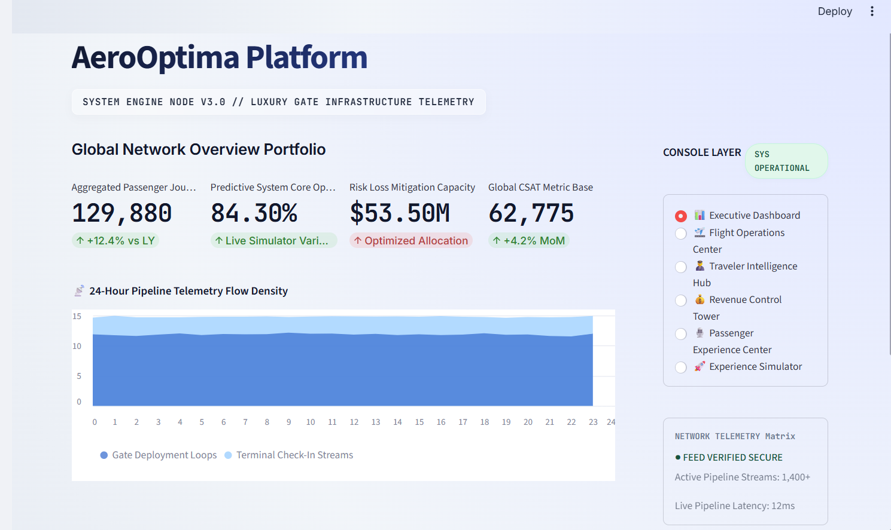

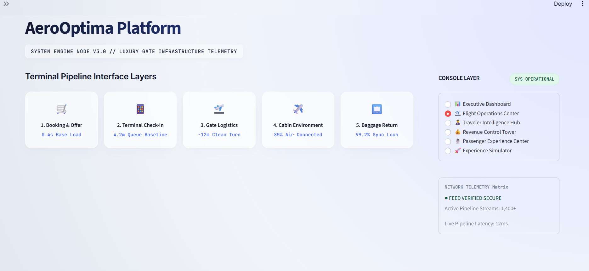

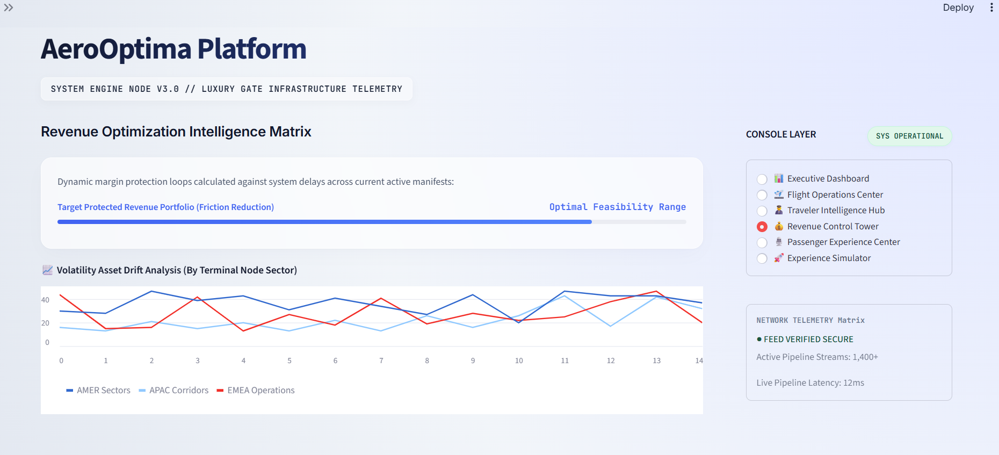

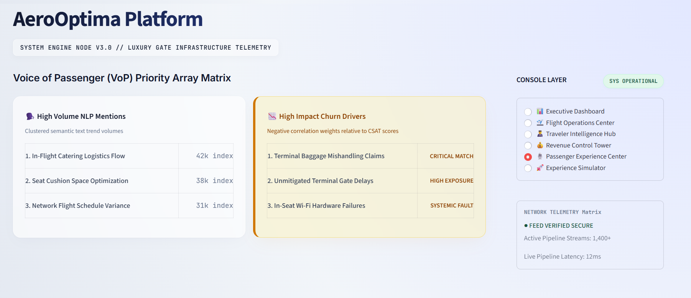

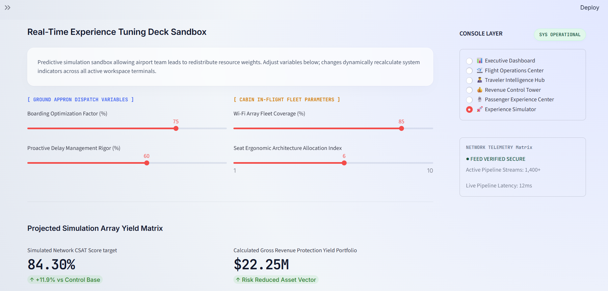

---

## Flight Operations Center

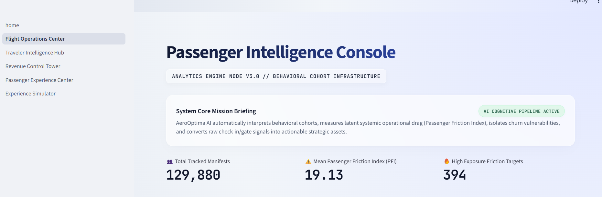

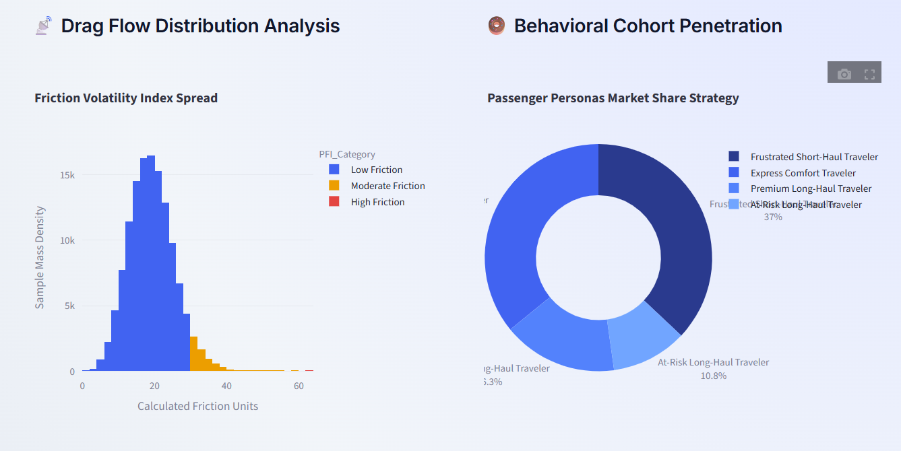

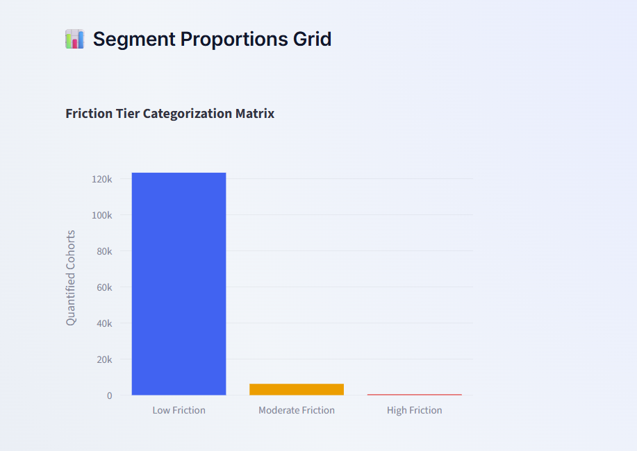

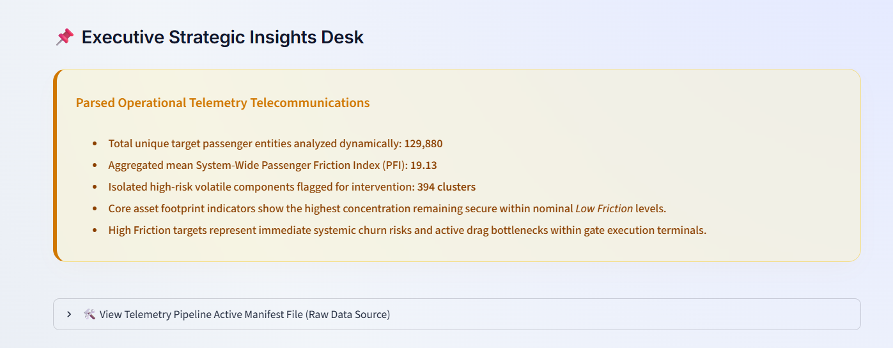

---

## Traveler Intelligence Hub

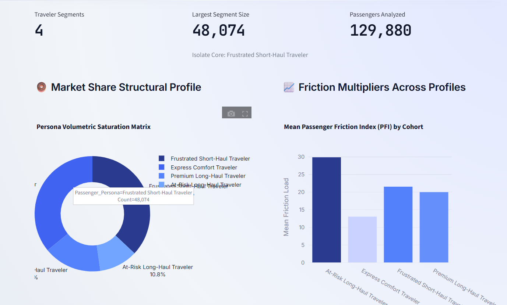

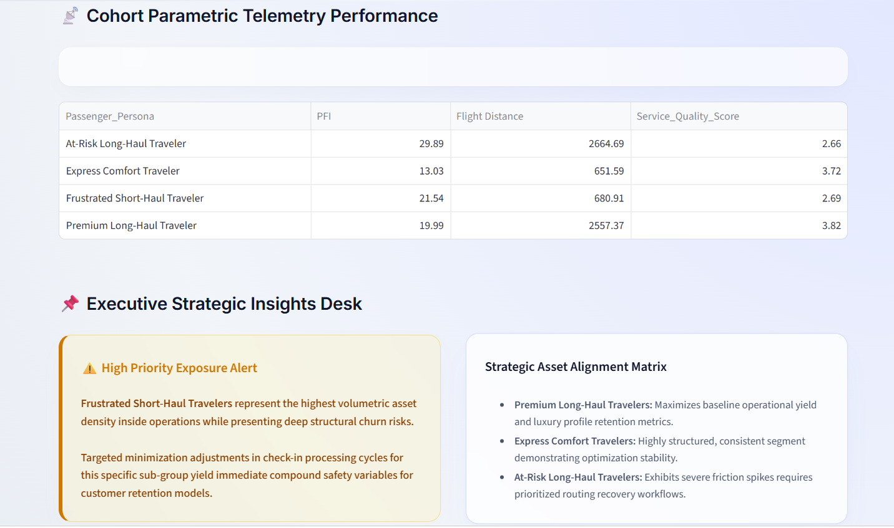

---

## Revenue Control Tower

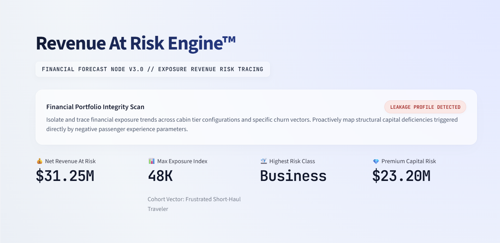

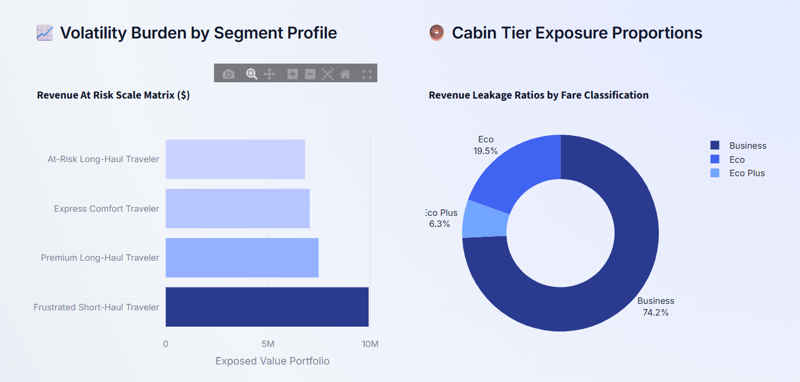

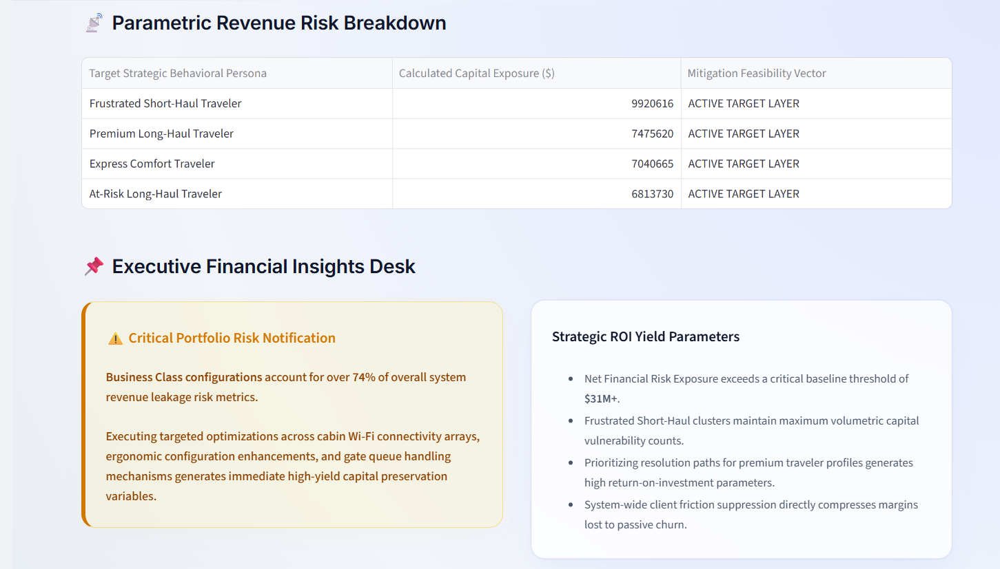

---

## Passenger Experience Center

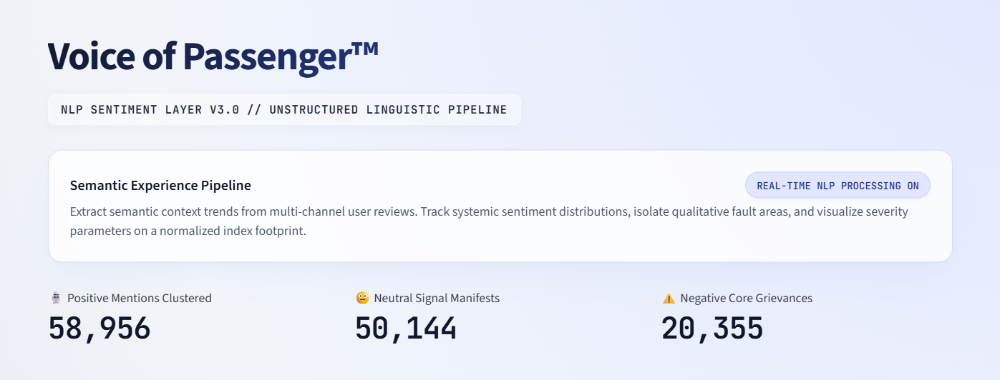

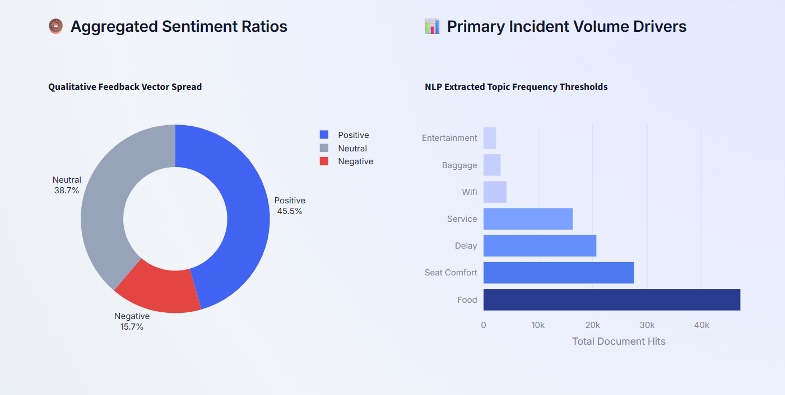

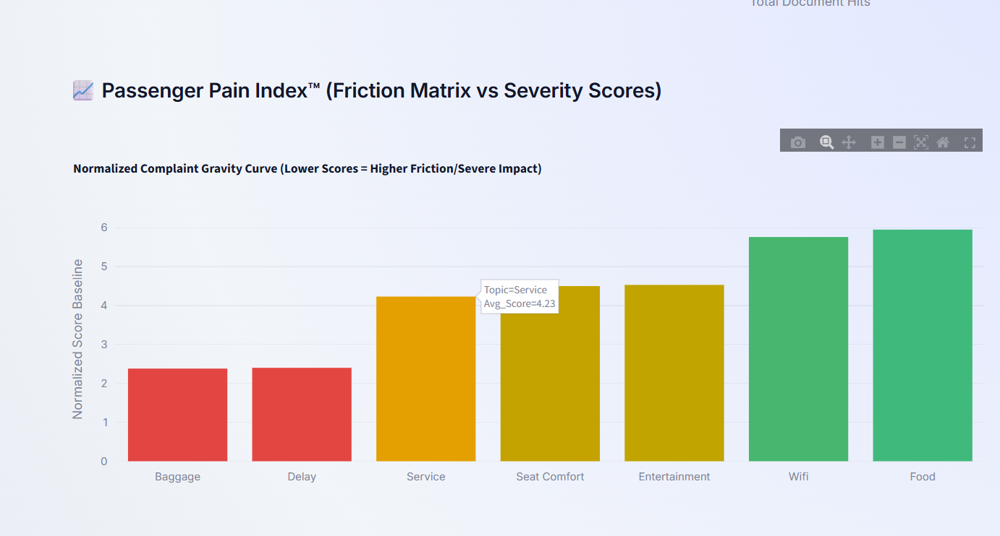

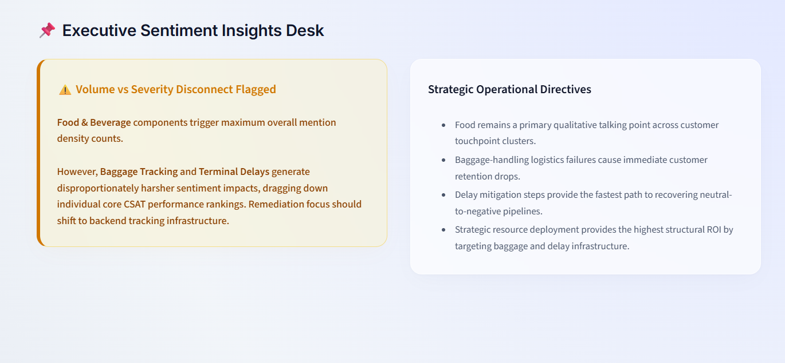

---

## Experience Simulator

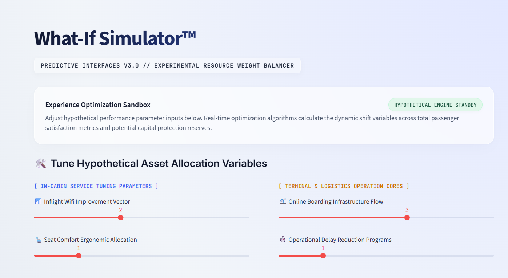

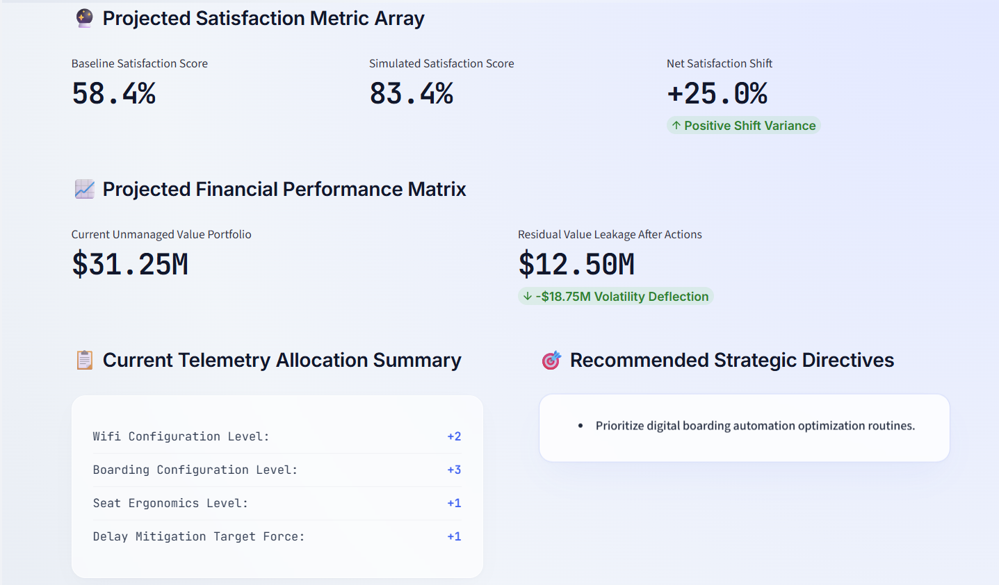

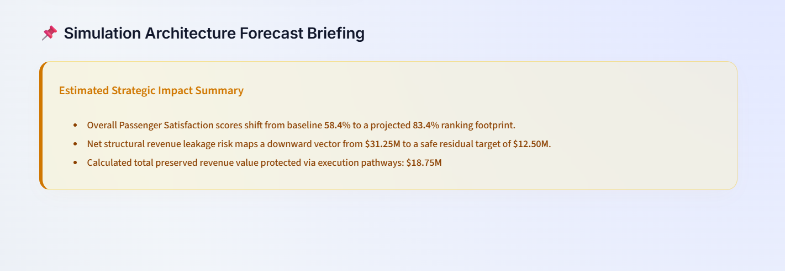

---

# 🛠️ Technology Stack

### Programming

* Python

### Data Processing

* Pandas
* NumPy

### Machine Learning

* Scikit-Learn
* K-Means Clustering
* Random Forest Classification

### NLP

* TextBlob
* Sentiment Analysis

### Visualization

* Plotly
* Streamlit

### BI

* Power BI

### Database

* SQL

---

# 📂 Repository Structure

```text
AeroOptima-AI
│
├── app/
├── notebooks/
├── dashboard/
├── sql/
├── screenshots/
├── docs/
├── requirements.txt
└── README.md
```

---

# 🔮 Future Enhancements

* Real-Time Flight Data Integration
* Passenger Churn Prediction
* Route-Level Analytics
* Dynamic Pricing Intelligence
* Crew Performance Analytics
* Generative AI Recommendation Engine
* Airline Operations Digital Twin

---

# 👨‍💻 Author

**Anu PS**

Computer Science Engineering Student

Focused on:

* Data Science
* Machine Learning
* Business Intelligence
* AI-Powered Decision Systems

GitHub: https://github.com/Anu05-ps

---

⭐ If you found this project interesting, consider starring the repository.

